# Procesverslag
Markdown is een simpele manier om HTML te schrijven.  
Markdown cheat cheet: [Hulp bij het schrijven van Markdown](https://github.com/adam-p/markdown-here/wiki/Markdown-Cheatsheet).

Nb. De standaardstructuur en de spartaanse opmaak van de README.md zijn helemaal prima. Het gaat om de inhoud van je procesverslag. Besteedt de tijd voor pracht en praal aan je website.

Nb. Door *open* toe te voegen aan een *details* element kun je deze standaard open zetten. Fijn om dat steeds voor de relevante stuk(ken) te doen.

## Jij

### Ontwerper:
Mirte Winter

#### Je startniveau:
Mijn startniveau is: rood. 
Ik heb gekozen voor rood omdat ik wel de basis begrijp van html css en op deze manier mijzelf wil uitdagen om meer te kunnen in html en css.

# Je plan

  
De eerste versie/schets van je ontwerp & je persoonlijke uitdaging

  ### De eerste versie:
  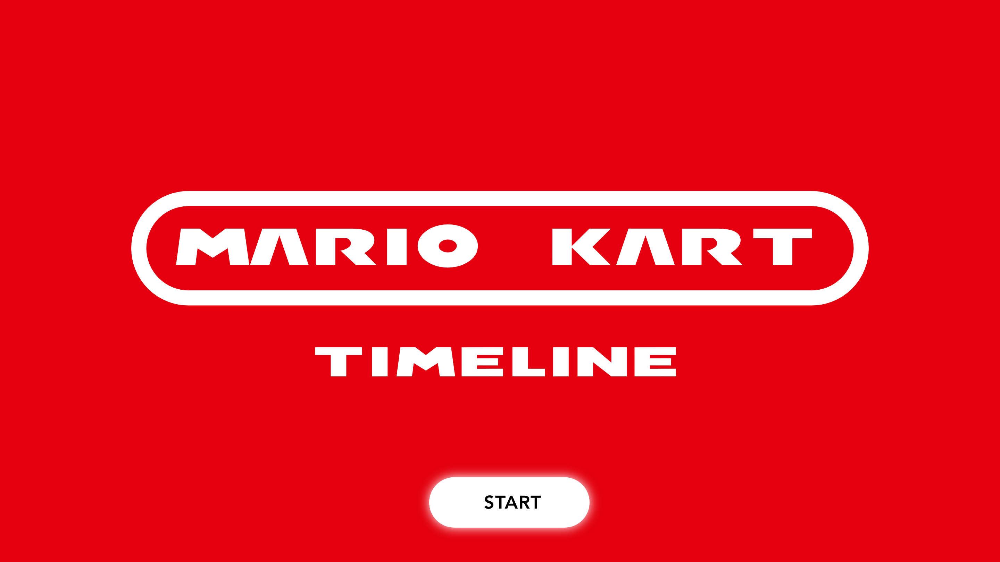
  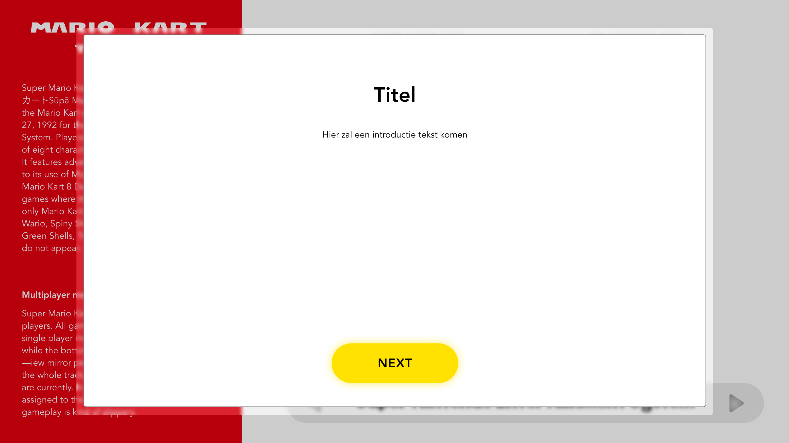
  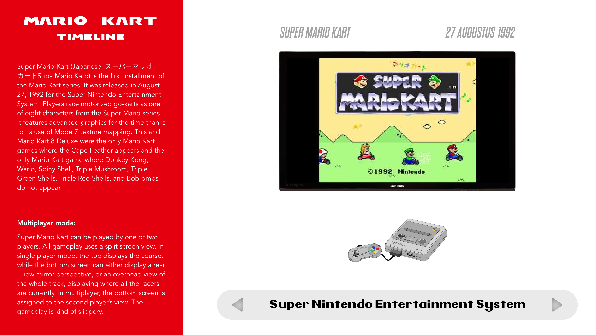

  ### De tweede versie/schets:
  Na het ontvangen van feedback tijdens les twee ben ik aan de slag gegaan met het verwerken van deze feedback. 
  
  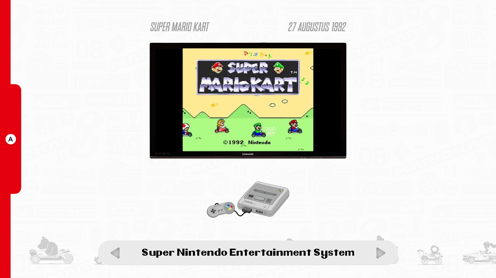
  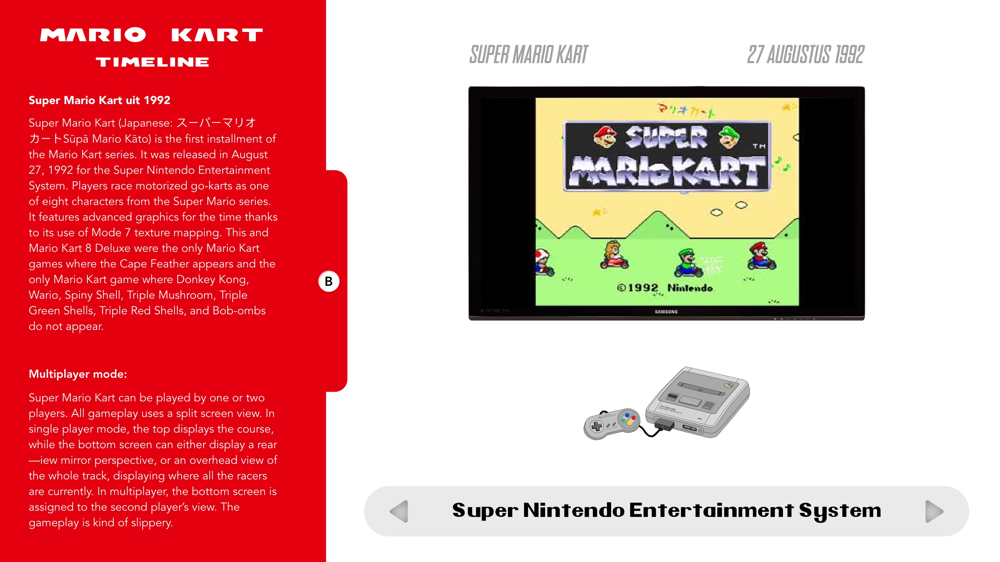

  ### Je ambitie: 
  Aan deze technieken/punten wil ik werken:
  - Ik wil graag beter worden in het gebruik van Grid. 
  - Ik zou graag mijn vaardigheden in het maken van vormen in css beter willen maken, zoals het maken van de tv en buttons. 
  - Javascript beter leren begrijpen
 

## Voortgang/Feedback 1

  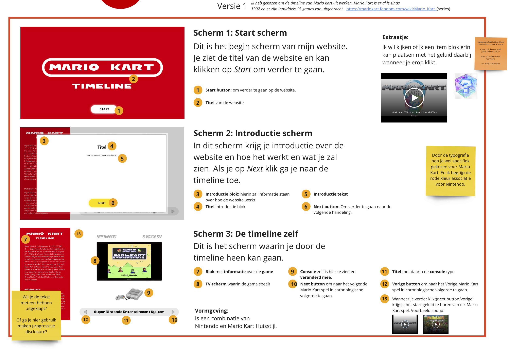

  
Mijn bevindingen + wijzigingen 

  ### Bevinding 1:
  "Wil je de tekst meteen hebben uitgeklapt? 
  Of ga je hier gebruik maken progressive disclosure?."

  #### **oplossing:**
  Ik had hier inderdaad nog niet over nagedacht. Ik heb daarom het idee verzonnen om om de informatie te laten verschijnen doormiddel van de A knop in te drukken en je kan B knop in drukken om het informatie blok te sluiten. 

  ### Bevinding 2:
  Om eerst een klein onderzoek te doen naar de maripo kart items om te beslissen welke ik in de website wil hebben. 

  #### oplossing:
  Diverse mario kart items op te zoeken in Google en welke Items het bekend zijn en welke ik zelf leuk vind om erin te zetten. 

  ### Bevinding 3:
  Is het wel nodig om een soort onboarding scherm toe te voegen?

  #### oplossing:
  Ik heb besloten om het onboarding scherm weg te laten zodat er niet teveel tussen schermen zijn tussen het start scherm en de tijdlijn zit. Het is naar mijn idee niet persee nodig om een onboarding toe te voegen aan de website als de website eigenlijk maar 2 main functies heeft. 
  het verder klikken tussen de consoles en tijdperken en informatie blokken open klappen. 

## Voortgang/Feedback 2

  
Mijn bevindingen + wijzigingen

    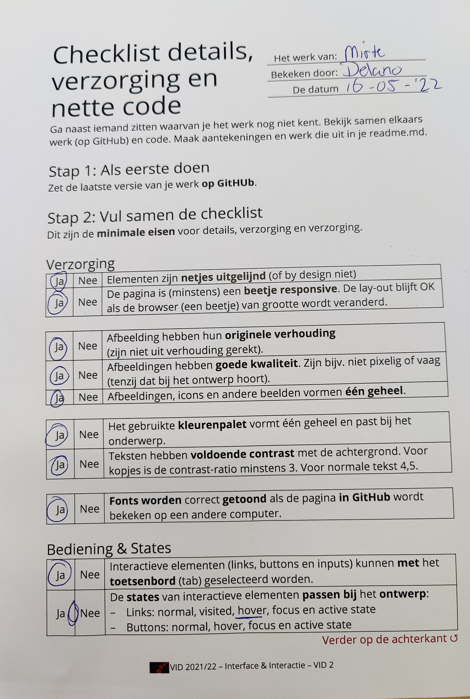
  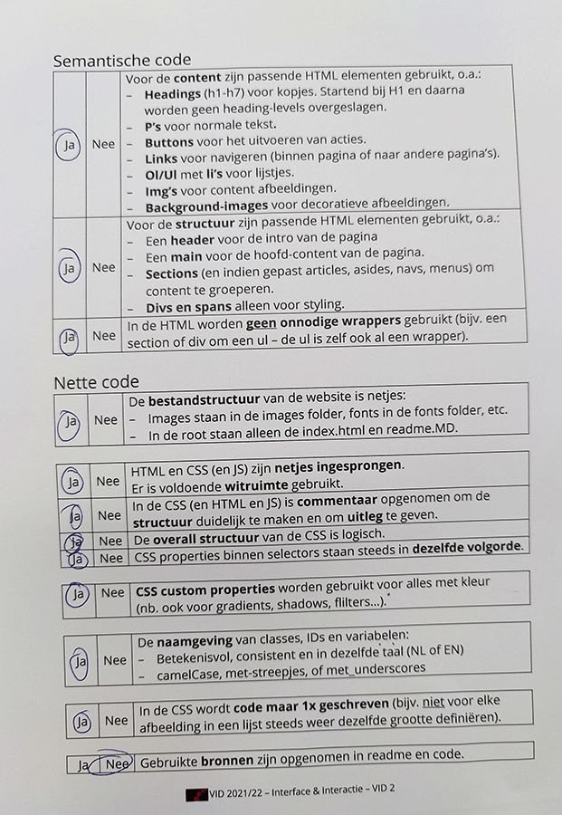

  
  ### Bevinding 1:
  Ik vind persoonlijk dat mijn website nog niet responsive genoeg is bij het tijdlijn scherm. 

  #### oplossing:
  Mijn plan is om dit nog een beetje aan te passen zodat de elementen niet te veel gaan verspringen. 

  ### Bevinding 2:
  Ik heb nog niet alle states van de buttons uitgewerkt. 

  #### oplossing:
  Alle mogelijke states die ik nog kan toepassen op buttons bekijken en eventueel toepassen. 

  ### Bevinding 3:
  Ik wil mijn code nog graag nalopen of het semantisch en goed ingesprongen is. 

 #### oplossing:
  Mijn code opnieuw chechen op semantiek en of het goed ingesprongen is. 

## Voortgang/Feedback 3

  
Mijn bevindingen + wijzigingen

      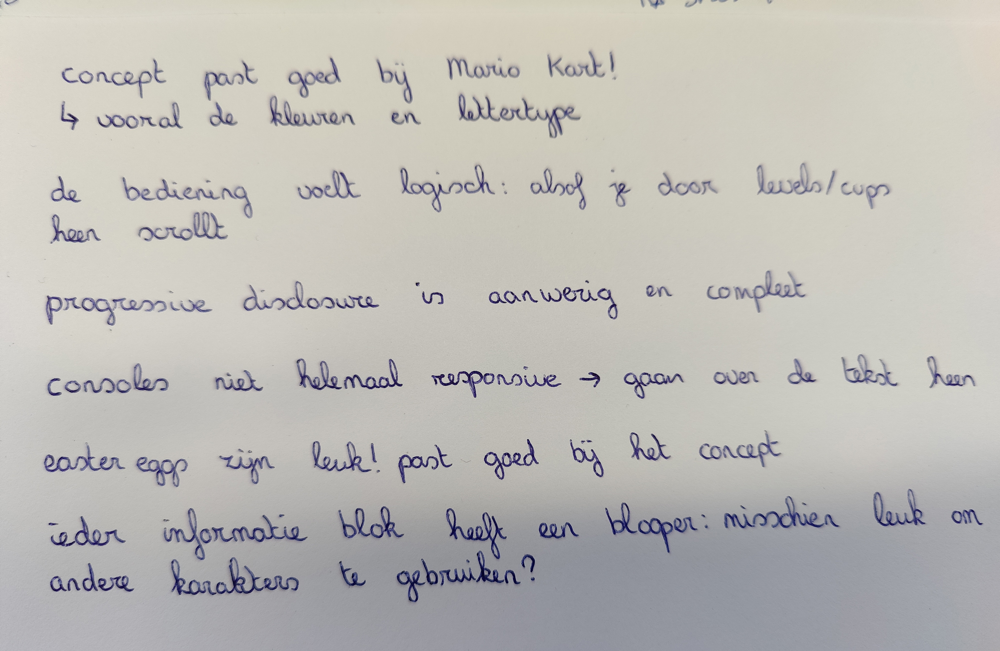

  
  ### Bevinding 1:
  Ik kreeg te horen van Ellen dat het misschien een leuk idee is om nog andere easter eggs toe te passen ipv de blooper in het rode blok. 

  #### oplossing:
  Aangezien ik hier niet genoeg tijd voor had heb ik dit niet kunnen aanpassen  

  ### Bevinding 3:
  de website is niet volledig responsive, de consoles bewegen te veel. 

  #### oplossing:
  Dit is mij helaas niet gelukt om aan te passen, want ik had hier niet genoeg tijd voor. :(

## Reflectie

  
Mijn eindresultaat & persoonlijke ontwikkeling

  ### Je uitkomst - karakteristiek screenshot(s):
  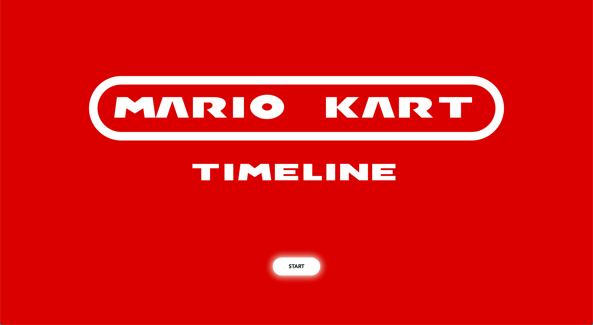
  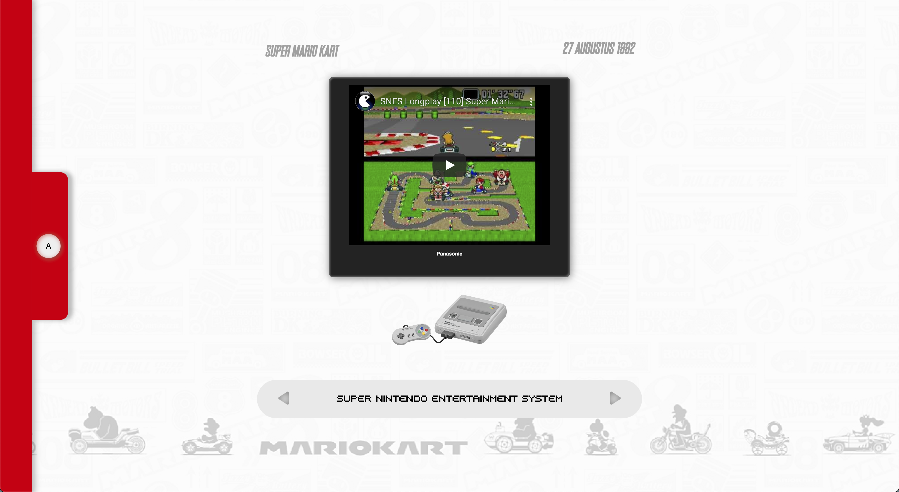
  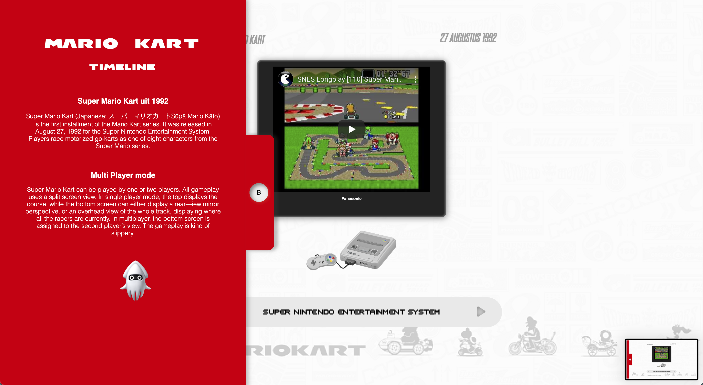

  ### Dit ging goed/Heb ik geleerd:
  Tijdens de lessen had ik een idee gemaakt waarvan ik aan het begin dacht gaat dit mij wel lukken. 
  - Tijdens één van de eerste lessen kregen we te horen over grid. Ik kende zelf wel al flexbox maar niet Grid. 
    Ik heb dit dan ook met de hulp van Sanne toegepast in mijn website. 
  - Ook heb ik geleerd over de :Root, in de root zet je alle kleuren neer van de website waarvan je later eventueel de kleuren zo kunnen wijzigen op één plek. Ik vind dit    een handige manier om de kleuren makkelijk te wijzigen in de css. Wel heb ik nog moeite met een goede naamgeving hiervan. 
  -  Javascript: Ik had als ambitie dat ik graag meer wilde leren over Javascript. Ik heb naar mijn idee dat doel gehaald.
   Wel heb ik nog steeds moeite met de function (){ }  goed neer te zetten en wat er allemaal mee werkt. 
   Als ik kijk naar hoe ik begon met Javascript dat ik er eigenlijk wat meer bang voor was en nu ben ik er eigenlijk meer enthousiast over geworden. 
   en begrijp ik nu beter hoe ik een variabel, event listener maak en dat ik met Javascript wat meer moet nadenken in stappen. 
   Eerst de variabel benoemen(wat wil je zoeken in je document), dan een eventlistener en daarna een function hoe ik het nu heb gedaan.
  - Ook heb ik geleerd hoe ik een start scherm kan maken. 

  Tevens vond ik het echt heel erg fijn om tijdens de lessen en na de lessen te werken aan de code aldus te knutselen!  
  Hierdoor konden we tijdens de lessen genoeg om hulp vragen bij de docent en bij medeleerlingen over coderen. 
  Ook waren de feedback momenten tijdens de lessen erg fijn hierdoor vergeet niet waar je allemaal op moet gaan letten in de website en wat er nog beter moet. 

  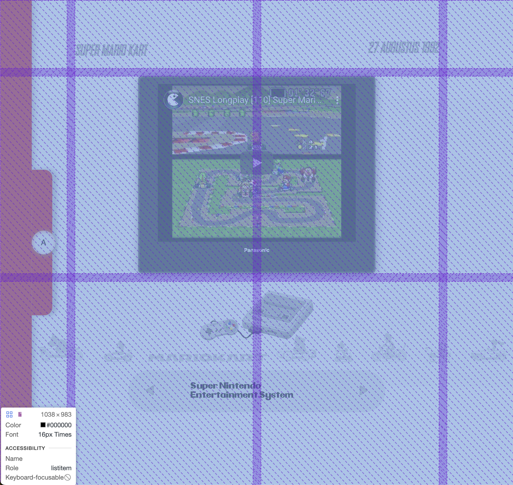
  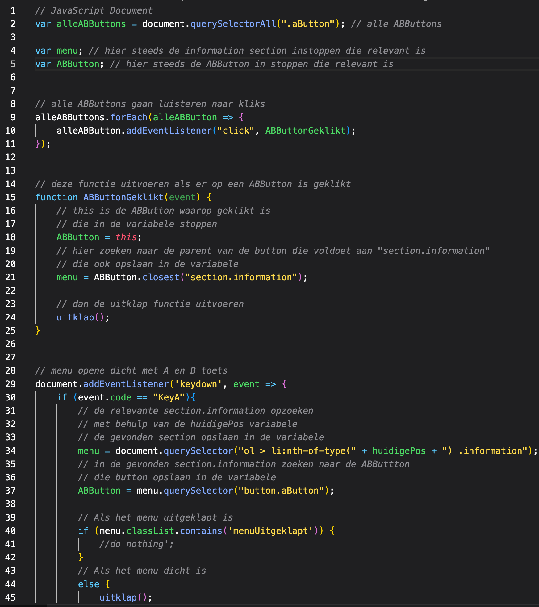

  ### Dit was lastig/Is niet gelukt:
  - Ik heb echt veel moeite gehad met Javascript. 
  In het begin van javascript heeft Sanne nog veel van mijn code geschreven, later kon ik dit proces zelf starten doordat ik wist hoe ik moest beginnen.
  wel maakte ik nog fouten met het aanroepen en de juiste formulering hiervan. Maar het voelde alsog ik steeds het beter begon te begrijpen en daar ben ik erg trots op.
  - Start scherm: Ik wist niet hoe ik een start scherm kon maken, ik heb hiervoor gegoogled maar ik kwam er niet uit. Ik heb daarna Sanne gevraagd om mij hiermee te helpen. 
  nadat hij dit had gemaakt zag het er eigenlijk best wel logisch uit en heb ik dit daarna ook uitgelegd aan Ellen en dat lukte haar ook :D!! 
  - Coin sound effect: het lukte mij niet
  - Splash effect: Ik heb zelf eerst onderzoek gedaan naar hoe ik dit effect zelf zou kunnen toepassen. Maar na langer dan een uur te hebben geprobeerd was mijn besluit dat ik Sanne om hulp zou gaan vragen. Sanne vertelde in één van de eerste lessen dat wanneer je langer dan 30 minuten bezig bent met code het verstandig is om iemand anders om hulp te gaan vragen. Sanne heeft mij geholpen met het werkend krijgen van het Splash effect. 
  - Array: Ik ben zelf nog steeds bang voor arrays, maar ik heb het wel het gevoel alsof ik nu de essentie snap van arrays. Het gebruik daarvan vind ik wel nog lastig. 
  - Transform: Ik had hiervoor weinig gewerkt met Transform en tijdens dit vak heb ik vaker gewerkt met transform waardoor ik hier beter mee heb leren werken en begrijpen. 
  - position relative/absolute: Ik snap nu beter het gebruik van deze code. Relative zit zo gezegd onder en absolute erboven.

 ### Niet gelukt
  - Wat mij niet gelukt is, is het toe passen van alle intro sounds van de Mario Kart per li.  
  Zelf vind ik nog dat ik graag als ik meer tijd en kunde had alle intro's van de Mario Kart games had willen toe voegen. 
  - Bij Start scherm had ik graag een titlescreen sound van Mario kart Wii willen toevoegen. Alsof je je echt op het start scherm bevind. 
  - Easter eggs: Ik had meer easter eggs/Items willen toepassen van Mario Kart zelf. Net zoals in Mario Kart wordt je overspoelt met items.
    Ik had dat ook een beetje willen doen in mijn website.

  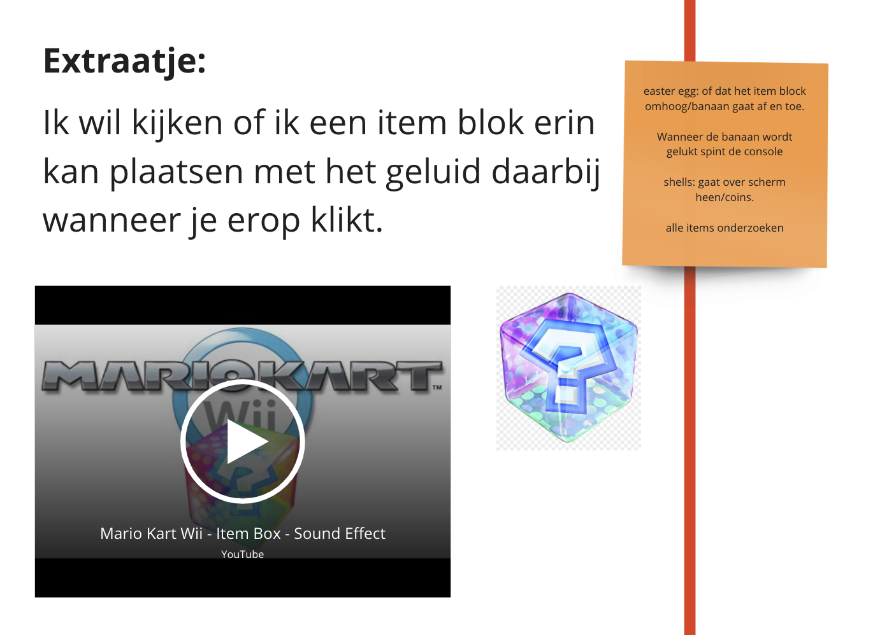

## Bronnenlijst

continu bijhouden terwijl je werkt

Nb. Wees specifiek ('css-tricks' als bron is bijv. niet specifiek genoeg).
 
Afbeeldingen:  
1. favicon afb: https://www.mariowiki.com/Mushroom_Cup
2. blooper afbeelding: https://mariokart.fandom.com/wiki/Blooper
3. Snes Console afb: https://www.seekpng.com/ima/u2q8e6o0q8i1w7r5/
4. Nintendo 64 afb: https://www.seekpng.com/ima/u2q8e6o0q8i1w7r5/
5. GameBoyAdvance afb: https://nl.m.wikipedia.org/wiki/Bestand:Game-Boy-Advance-SP-Mk2.png
6. GameCube afb: https://nl.wikipedia.org/wiki/Nintendo_GameCube
7. Ds lite afb: https://www.xgame-stores.com/nintendo-ds-lite
8. Wii afb: https://en.wikipedia.org/wiki/List_of_best-selling_Wii_video_games
9. Wii U afb: https://nl.wikipedia.org/wiki/Wii_U
10. Switch afb: https://www.schiphol.nl/nl/op-schiphol/shoppen/producten/nintendo-switch-console/17022203
11. mobiel afb: https://www.t-mobile.com/cell-phone/apple-iphone-12
12. coin afb: https://www.mariowiki.com/Gallery:Coin
13. ink splash afb: https://nl.pinterest.com/pin/185140234670948225/

Informatie: 
14. alle informatie over de games: https://mario.fandom.com/wiki/MarioWiki & https://en.wikipedia.org/wiki/Mario_Kart
15. Informatie mario kart tour: https://www.mariowiki.com/Mario_Kart_Tour

*Video's:*
16. Video Mario Kart Tour: https://www.youtube.com/watch?v=rECi0_mbnng
17. Video Mario Kart 8: Deluxe: https://www.youtube.com/embed/wYrkzFLSwXA
18. Video Mario Kart 8: https://www.youtube.com/embed/vEwfjxPkAdQ
19. Video Mario Kart Wii:https://www.youtube.com/embed/crQeb1pm2IA
20. Video Mario Kart DS :https://www.youtube.com/embed/v0_LYLcsprM
21. Video Mario Kart Double Dash Gamecube: https://www.youtube.com/embed/3hZbP7hyD6M
22. Video Mario Kart Super circuit Gameboy: https://www.youtube.com/embed/eKenhVh-9UE
23. Video Mario Kart 64: https://www.youtube.com/embed/acuR_mxectk
24. Video Mario Kart SNES: https://www.youtube.com/embed/AlAmXXNz5ac

*Personen:*
- Sanne 't Hooft: Javascript, Display:grid;, pointer events, aside en debuggen.
- Yarre: Array hulp
- Milan: Array hulp
Ik heb tijdens het coderen veel hulp gehad van Sanne, hij heeft mij veel geholpen met het uitleggen van de code, javascript, display:grid;.
tevens heb ik ook hulp gehad van Yarre en Milan met Array uitleg en het schrijven van die code daarvan. 

